  

<a href="https://kitneybean.github.io/kitneybean/">
  <picture>
    <source media="(prefers-color-scheme: dark)" srcset="https://raw.githubusercontent.com/kitneybean/kitneybean/output/sniper-dark.svg">
    <source media="(prefers-color-scheme: light)" srcset="https://raw.githubusercontent.com/kitneybean/kitneybean/output/sniper-light.svg">
    
  </picture>
</a>

🎯 <a href="https://kitneybean.github.io/kitneybean/"><b>Взять винтовку</b></a> — открой стрельбище и целься мышкой сам · разведданные обновляются каждые 6 часов

---

### `> whoami`

<!-- поправь под себя -->
- 🔭 Пишу на **C# / .NET** и **Python**, иногда **JavaScript**
- 🛠️ Делаю десктоп-приложения, серверы и ботов
- 🎯 Мой граф активности — это тир. Заходи [пострелять](https://kitneybean.github.io/kitneybean/)

### `> arsenal`

  

### `> range rules`

| Управление | |
|---|---|
| 🖱️ **Мышь** | прицел (он тяжёлый и гуляет от дыхания) |
| 🔫 **ЛКМ** | выстрел · затвор передёргивается сам |
| ⌨️ **Shift** | задержать дыхание — прицел замирает на пару секунд |
| 🔍 **Колесо / ПКМ** | зум оптики |
| 🔄 **R** | перезарядка, в магазине 5 патронов |
| 🛡️ **Яркие клетки** | бронированные, держат два попадания |

Хочешь расстрелять чужой граф? Добавь ник в адрес: <code>kitneybean.github.io/kitneybean/?user=torvalds</code>

  

